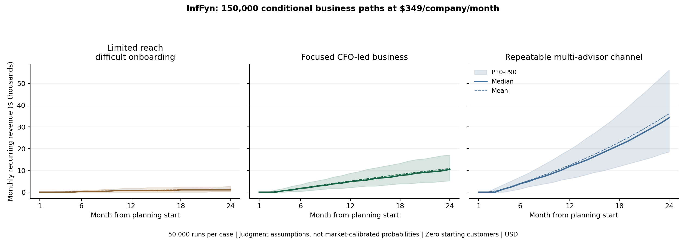

# InfFyn: product quality, commercial outlook and next evolution

Prepared September 11, 2026. This is a planning assessment, not a change to pricing, scope, hosting or the release checklist. The product and commercial model were independently reviewed. Competitors were researched from current official sources. No customer interviews or real-company usability trials were conducted for this report.

**Interpretation clarification, September 11:** the simulated acquisition rates were selected assumptions, not findings about product quality, market demand or Stephen's sales capability. The model does not establish low earning potential. The subsequent [reviewed-import and growth plan](INFFYN-PRODUCT-AND-GROWTH-PLAN-2026-09-11.md) deepens the competitor comparison and calculates the acquisition requirements for explicit customer targets. Preserve the original simulations as conditional sensitivity analysis.

## My judgment

**InfFyn has a credible foundation for a focused finance software business. We have not yet demonstrated a dependable hosted product or recurring customer demand.** Its quality is strongest in how it treats evidence, allocations and historical results. Its next challenge is getting a real company to a useful reviewed month, then making the next month easy enough that the company keeps using it.

I would pursue the company-level AI economics review before broadening into a finance platform. The opportunity is to become the place where a finance leader and an engineering owner agree on what AI cost, what business activity it supported, which conclusions are defensible, and what decision follows. The company should be able to use InfFyn directly or through its advisor.

That can support a worthwhile small business. A million-dollar recurring-revenue business is arithmetically possible, but the evidence does not yet justify treating that as an expected outcome, estimating a valuation or assigning a probability of success.

## What quality have we actually achieved?

| Dimension | Assessment today | What would change the assessment |
|---|---|---|
| Financial reasoning | Strong foundation within the declared cost/revenue scope | Real supplier totals, reviewed revenue basis and actual outcome evidence reconcile without bespoke repairs |
| Evidence and history | Strong local implementation: visible unknowns, preserved lineage, reviewed allocation and immutable reports | Hosted reports reproduce and corrections preserve prior versions |
| Company presentation | Considerably more purposeful and coherent than the first prototype | Finance and engineering users independently complete the intended flow |
| Ease of adoption | Still a material risk | Data arrives in usable form and the first report fits one working session after evidence is available |
| Recurring usefulness | Plausible, not demonstrated | Second and third monthly reviews support real decisions and renewal |
| Operating readiness | Private-alpha candidate; activation remains pending | Actual recovery, sign-in, company isolation, persistence, retention and hosted acceptance pass |
| Commercial differentiation | Narrow and unproven | Buyers choose this workflow over existing tools or their spreadsheet process at a stated price |

Current recorded local verification includes 280 engine tests, 109 targeted checks, 17 migration replays, a synthetic encrypted restore and the alpha-mode app build. These are useful engineering evidence; they do not establish hosted operation or product-market fit. [Activation checklist](../docs/PRIVATE-ALPHA-ACTIVATION.md), [implementation receipt](../outputs/private-alpha-implementation-2026-09-11.json).

As a hypothetical CFO, I would be willing to evaluate the supervised alpha once engineering completes activation. I would need to see my own first and second month, the preparation effort and a decision supported by the analysis before relying on the product as an ongoing finance process. A realistic-looking demonstration alone would not answer those questions.

## Who should buy it first?

The best initial buyer is a company spending roughly **$10,000–$100,000/month on AI**, with multiple meaningful workloads, a finance owner, an engineering or operations data owner, and a current pricing, margin or workflow-investment decision. Spend screens for possible materiality; complexity and a pending decision establish the stronger need.

Prioritize two related situations in the same company workspace:

1. **Revenue-producing products and services.** A research product, document service or AI-enabled SaaS offering needs to understand included serving costs and contribution across customers/workloads. Revenue associations must be reviewed; shared subscription revenue is not automatically caused by a feature.
2. **Internal custom workflows with accepted outcomes.** Support resolution or document processing can have costs, failed attempts, quality criteria and accepted units. Track cost per accepted outcome and performance. Keep modeled staff capacity separate from realized payroll savings.

Seat-only AI subscriptions with no workflow or outcome data are a weaker initial value-attribution segment. They can support an expense inventory, but provider invoices cannot tell us whether employees created additional business value. Very large enterprises and companies already satisfied by their observability/FinOps stack are also poor first targets without a specific unresolved review job.

The accompanying [product assessment](strategy-2026-09-11-product.md) works through five explicitly hypothetical buyer journeys: research SaaS, an AI service firm, internal support, an advisor with several companies and a telemetry-rich developer company. These are test cases for real users, not simulated customer endorsements.

## Market appeal and the differentiator we must earn

The need is credible. The FinOps Foundation's 2026 practitioner survey describes cost visibility, allocation and AI value as active concerns. Its sample is predominantly enterprise; it cannot establish adoption, market size or willingness to pay in our smaller-company ICP. [State of FinOps 2026](https://data.finops.org/).

Competition is substantial. Revenium advertises customer/workflow attribution and margin analysis. Spendline explicitly describes invoice reconciliation and locked monthly periods. Vantage lists a $200/month plan covering up to $20,000 tracked spend. These are vendor claims and public offers, not independently tested head-to-head results. [Revenium](https://www.revenium.ai/pricing), [Spendline](https://www.spendline.ai/what-is-spendline/), [Vantage pricing](https://www.vantage.sh/pricing).

Our candidate advantage is **a simpler, repeatable financial review delivered through a trusted fractional CFO, using the customer's existing evidence and preserving company ownership**. That is an execution and distribution hypothesis. Calculating token costs, adding a confidence score, exporting a PDF and displaying margins are not sufficient advantages by themselves.

To earn the position, InfFyn needs to make four things measurably easier: obtain the evidence, resolve the meaningful exceptions, communicate a decision, and repeat next month. If a competing tool or a spreadsheet already does that with less effort, we should disqualify the prospect or improve that precise gap rather than build another platform.

## What the simulations say

I ran **150,000 primary 24-month business trajectories**, 50,000 within each operating case, plus **300,000 sensitivity and stress trajectories**. The baseline uses the repository's **$349/company/month** offer. There is no current paid revenue implied by that configured price; private alpha remains complimentary.

The model varies qualified introductions, discovery, usable-data conversion, paid conversion, customer churn, referral growth, onboarding time, recurring delivery, partner shares and costs. It includes correlated adoption friction, finite service capacity, a sales lag and an activation delay. It starts with zero paying customers. All cases assume eventual activation and continued operation; no probability is assigned to those conditions or to which case will occur.

**These are conditional ranges from judgment assumptions, not probabilities calibrated from real customers.** Tens of thousands of draws tell us the implications of our assumptions more consistently. They do not tell us whether the assumptions are true.

| Operating case at $349 | Median MRR, month 12 | Median customers, month 24 | Median MRR, month 24 | Mean MRR, month 24 | Middle 80% of modeled MRR, month 24 |
|---|---:|---:|---:|---:|---:|
| Limited reach; difficult onboarding | $698 | 3 | $1,047 | $1,282 | $349–$2,792 |
| Focused CFO-led business | $4,886 | 30 | $10,470 | $10,855 | $5,235–$17,101 |
| Repeatable multi-advisor channel | $11,866 | 98 | $34,202 | $36,043 | $18,497–$56,189 |

The first case has modal four qualified introductions/month, weak data conversion and three recurring support hours/account. The focused case starts at modal eight introductions/month, 65% usable-evidence conversion from discovery, 40% paid conversion from usable evidence, 3% monthly churn and 1.25 delivery hours/account. The advisor case assumes multiple productive relationships, growing introductions and substantially more efficient service. Stephen's present network has not established that throughput.

The means exceed the medians because successful high-volume paths pull the distribution upward. Zero revenue remains possible outside these conditions, including failure to activate or recruit users. P10 is not a floor, P90 is not a ceiling, and the three cases are not a probability-weighted forecast. [Complete model, distributions and reproduction instructions](commercial-model-2026-09-11/README.md).

## Revenue is different from what the founders earn

The model costs delivery labor even when founders do it, deducts partner/payment fees, platform expenses and fixed overhead, and then includes an **illustrative $8,000/month combined owner allowance for non-delivery work**. This is a planning choice, not an existing payroll obligation.

| Month-24 median, current $349 offer | Before owner allowance, after other modeled costs | After $8,000 owner allowance |
|---|---:|---:|
| Limited reach | ($1,000) | ($9,000) |
| Focused CFO-led business | $2,217 | ($5,783) |
| Multi-advisor channel | $12,409 | $4,409 |

At roughly $10,000 MRR, a labor-heavy review service can leave very little for building and selling the product. That is the main commercial warning. A software price with consulting-level delivery is difficult to sustain.

The channel case's positive final-month result also follows a long ramp: its median cumulative 24-month modeled surplus is approximately **negative $126,000**, including the owner allowance and imputed labor. That is not automatically a funding requirement or cash burn. It means the final run rate does not retroactively pay for all modeled founder and delivery effort. Taxes, financing, bad debts and sunk development costs are excluded.

Repricing the same focused customer paths at **$900/month** gives a median $27,000 MRR and about $7,725 after modeled costs and the owner allowance at month 24. This holds acquisition and churn unchanged. It therefore shows price arithmetic, **not evidence that a $900 package would sell or retain**. Higher pricing can change conversion, expectations and delivery costs. No product pricing has changed.

At a simpler scale:

| Recurring-revenue target | Customers required at $349 | Customers required at hypothetical $900 |
|---|---:|---:|
| $20,000 MRR | 58 | 23 |
| $50,000 MRR | 144 | 56 |
| $1 million annual run rate | 239 | 93 |

These are rounded-up customer requirements, not market forecasts. A $1 million annual run rate is about $83,333 MRR; it is not $1 million already collected. A higher-priced advisory service should have its labor priced explicitly and kept separate from scalable software revenue.

## Which assumptions matter enough to build around?

Controlled changes in the focused model illustrate the priorities, with other distributions retained:

- Initial introductions fixed at four versus sixteen per month move median month-24 MRR from about **$4,900 to $15,000**; service capacity constrains the gain.
- Usable-evidence conversion fixed at 35% versus 85% moves median MRR from about **$5,600 to $12,600**. Removing data-preparation friction directly changes the number of companies we can serve.
- Recurring support fixed at three hours versus half an hour moves median month-24 surplus from about **negative $9,100 to negative $3,600**, after the owner allowance. Higher revenue alone does not solve low delivery efficiency.
- An 80% referral reduction for six months lowers focused median month-24 MRR from **$10,470 to $8,376**. A personal relationship is useful distribution and a concentration risk.

These are model perturbations, not observed causal effects. They identify the data to collect and the work most likely to matter under the assumptions.

## The next product evolution

The goal should be **a dependable monthly AI economics review with a small decision-follow-through loop**. Retain one engine and two economic lenses: product contribution and internal accepted-outcome efficiency.

| Stage | Focused build | Evidence gate | Planning horizon |
|---|---|---|---|
| Activate the current alpha | Actual recovery, inspected migrations, verified identities, hosted CSV/draft/report and company separation | Engineering's hosted acceptance checklist passes | Immediate; depends on secure access and recovery, not a new feature sprint |
| Make the second month easy | Reusable reviewed mappings, targeted import assistance, useful missing-evidence guidance | At least three companies complete a month; at least two repeat; handling time recorded | First 30–60 days of actual use |
| Show whether decisions helped | Attach owner, action, intended metric and later observation to an existing finding; add compatible-workload comparison bridges | Two documented decisions with follow-up; customers choose continued paid use once billing is authorized | Following one or two review cycles |
| Strengthen standalone operation | Verify the provider connectors and paid-release controls; automate the most repeated preparation; optional bounded what-if analysis | Repeated paid use with acceptable support effort and a buyer beyond Stephen's immediate relationships | Following 60–120 days, conditional on the evidence |
| Integrate FynScale OS | Same company workspace, revocable advisor access, report-version handoff into OS review/release | Standalone economics and both systems' permissions work independently | Q2 2027, preserving the planned window |

These horizons mostly reflect time to observe customers over multiple months. They are not a four-month engineering commitment. Keep each follow-on change small and tied to a repeated failure or decision. The existing OpenAI/Anthropic/Stripe public-release verification requirements remain; the CSV-only alpha is the agreed exception.

For the next small product improvements, I would prioritize:

1. **Evidence readiness in plain language.** Show “cost: 4 of 5 checks complete” with what is missing. The current 0–100 values are five equal checklist items, not statistical confidence or the probability that AI caused a return. Keep cost, revenue and outcomes separate. [Current calculation](../engine/app/monthly/confidence.py).
2. **Repeat preparation and scope-aware comparisons.** Carry forward reviewed configuration and recheck it. Current comparison logic safely blocks the entire comparison when scope changes; the next improvement is to compare still-compatible workloads while explicitly bridging new or changed scope. [Current comparison](../engine/app/monthly/economics.py).
3. **Decision follow-through.** Let the CFO record the investigation/action and its owner, then revisit the intended metric next month. Do not turn an expected improvement into verified savings before evidence arrives.

Later bounded planning can estimate volume, acceptance rate, model mix, price and review-labor scenarios using each company's baseline. Keep modeled outcomes separate from reported actual periods. Cross-company grades, autonomous model routing, employee productivity scoring and a broad procurement or finance OS would add complexity before the recurring job is proven.

## The next commercial checkpoint

Engineering should activate and prove the product. Stephen should recruit and assess usefulness. Give him a narrow offer and a measured review process rather than asking whether the demo looks valuable.

For the first cohort, record qualified introductions, missing evidence, first-result time, customer/Stephen/engineering handling minutes, the decision supported, the price offered and the reason to continue or decline. Keep a real renewal separate from a complimentary return. A proposed target is first review within one working session after evidence is available, customer month-two review within an hour, and recurring InfFyn support below 30 minutes/account after stabilization. These are operating goals, not current measured performance.

If companies repeatedly want one useful investigation but not another month, package an audit service. If they want recurring review but need substantial expert labor, separate software and advisory pricing. If they repeat with little assistance and pay, expand the channel and build the data preparation that supports those accounts. Three to five companies are enough to expose bad assumptions; they are not enough to estimate durable churn or the size of the market.

**My recommendation is to keep building toward the monthly review and its repeat use.** The next important milestone is a company returning with a second month's evidence and paying because the process is worth repeating. That would improve the commercial case more than another feature-heavy release or another hundred thousand simulation draws.

## Packet contents

- [Competitive assessment and primary sources](strategy-2026-09-11-competition.md)
- [Product assessment and five hypothetical ICP journeys](strategy-2026-09-11-product.md)
- [Model assumptions and reproduction guide](commercial-model-2026-09-11/README.md)
- [Full modeled results](commercial-model-2026-09-11/results.json)
- [Independent model review](commercial-model-2026-09-11/model-review.md)
- [Observed-learning template](commercial-model-2026-09-11/validation-log-template.csv)

Current repository and activation records were inspected for this assessment. Earlier InfFyn/FynScale decisions were used for continuity of company ownership, provenance and the Q2 integration design; old OS implementation details must be rechecked before integration.
